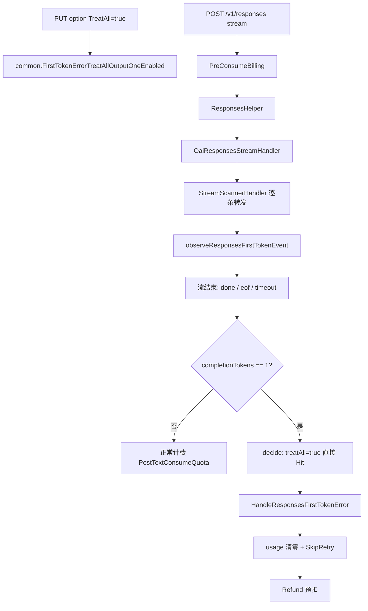

# 开关打开时：首字后错误完整判定链路

本文描述本地打开 **「将所有 1 token 输出视为上游错误」**（`FirstTokenErrorTreatAllOutputOneEnabled = true`）之后，一条 OpenAI Responses **流式**请求如何被判定为首字后错误。代码以当前仓库为准。

开关默认是关的。打开后，判定从「1 token **且** 实际报错」放松成「只要最终输出被算成 **恰好 1 token**」。真成功、`status=completed` 的短回复也会命中。

---

## 1. 范围（不在范围内就不会走这条链路）

| 条件 | 要求 |
| --- | --- |
| 协议 | OpenAI Responses（`/v1/responses` 流式） |
| Handler | 只进 `OaiResponsesStreamHandler` |
| 总开关 | `FirstTokenErrorCorrectionEnabled` 必须为 true（默认 true） |
| 本开关 | `FirstTokenErrorTreatAllOutputOneEnabled` 为 true |

不会走这条链路：

- 非流式 `OaiResponsesHandler`
- Chat Completions、Claude、Gemini 等其它协议
- `FirstTokenErrorCorrectionEnabled` 已关闭

流扫描阶段 **不会** 主动掐 SSE。判定发生在 `StreamScannerHandler` 返回之后。

---

## 2. 开关如何落到运行时

```
管理页 Switch
  → PUT /api/option/  { key: FirstTokenErrorTreatAllOutputOneEnabled, value: true }
  → controller.UpdateOption
  → model.UpdateOption → options 表
  → updateOptionMap → common.FirstTokenErrorTreatAllOutputOneEnabled = true
```

前端：`web/src/features/first-token-errors/components/settings-bar.tsx`  
后端变量：`common/constants.go`  
写入：`model/option.go` 的 `case "FirstTokenErrorTreatAllOutputOneEnabled"`

进程重启后从 `options` 表再灌进内存。代码里的字面量默认值仍是 `false`，以库里保存的值为准。

---

## 3. 请求调用栈

```
controller.Relay
  → PreConsumeBilling（预扣）
  → relayHandler
      → relay.ResponsesHelper          // HTTP 200 才继续
          → adaptor.DoResponse
              → OaiResponsesStreamHandler   // 本文核心
  → 若返回 error：
      processChannelError
      shouldRetry == false（SkipRetry）
      defer Billing.Refund（退预扣）
  → 若返回 nil：
      PostTextConsumeQuota（正常结算）
```

命中首字后错误时 **不会** 走到 `PostTextConsumeQuota`，因为 `ResponsesHelper` 在 `DoResponse` 报错后直接 return。

---

## 4. 流扫描：只观察、原样转发

`OaiResponsesStreamHandler` 对每一条 SSE `data:`：

1. JSON 解成 `dto.ResponsesStreamResponse`
2. `observeResponsesFirstTokenEvent` 更新扫描状态（报错 / 真 completed / 错误文案）
3. 按 type 采 usage、拼 delta 文本、计工具/图片
4. `sendResponsesStreamData` 转给客户端

看到 `response.failed` **不会** `sr.Stop()`。连接跟着上游走完。

扫描结束后，`info.StreamStatus.EndReason` 由 scanner 写入，常见值：

| EndReason | 何时 |
| --- | --- |
| `done` | 收到 `data: [DONE]` |
| `eof` | 对端关闭且没有 `[DONE]` |
| `timeout` | 流超时 |
| `client_gone` | 客户端断开 |

准则 4 只用 `eof`。开关打开后准则 4 **不是**命中前提，只影响「没有上游原文时用哪句错误文案」。

---

## 5. 「1 token」怎么算（硬门槛）

```
decisionTokens = 上游 usage.CompletionTokens（来自 output_tokens）
若上游 completion == 0：
    用 response.output_text.delta 拼出的正文做 CountTextToken
    仅当估算结果 == 1 时，decisionTokens 才改成 1
```

`completionTokens != 1` 时，**即使开关打开也 miss**。0、2、12 都不会当成首字后错误。

---

## 6. 判定函数（开关打开时的核心差异）

```go
func decideResponsesFirstTokenError(..., treatAllOutputOne bool) {
    if completionTokens != 1 {
        return miss
    }
    criterion4 := !sawTrueCompleted && endReason == EOF
    actualError := actualError || criterion4
    if !treatAllOutputOne && !actualError {
        return miss          // 关开关：没有实际报错就放过
    }
    // 开开关：只要 1 token 就 Hit，包括真 completed
    ...
}
```

打开后 `if !treatAllOutputOne && !actualError` 为假，不再要求 `actualError`。

### 6.1 扫描状态怎么来

`sawTrueCompleted`：事件 type 为 `response.completed` 或 `response.done`，且 `response.status` 恰好是 `"completed"`（大小写不敏感，其它值都不算）。

`actualError` 任一即可：

- type 为 `error` / `response.error` / `response.failed`
- `response.status` 为 `failed` 或 `incomplete`（`cancelled` 不算）
- 任意事件解析出非空错误文案（`response.error.message` > 事件 `error.message` > `code + message` > 顶层 `message`）

开关打开后，这些只影响 **错误原文**，不再决定是否 Hit。

### 6.2 错误原文

有扫描到的 `errorMessage` 就用原文。否则：

| 条件 | 文案 |
| --- | --- |
| 准则 4（未见真 completed，且 eof） | `stream closed before response.completed` |
| 其它（含真成功的 1 token） | `output_tokens=1 treated as upstream error` |

所以：上游认为正常、开关开着、`output_tokens=1`、有 `status=completed` 时，记录里通常就是第二句。

---

## 7. 命中之后

1. 用清零前的 dirty usage 算 `would_be_quota`（快照，不是实扣）
2. `HandleResponsesFirstTokenError`
   - `info.FirstTokenErrorHandled = true`
   - `OverrideEndReason(first_token_error)`
   - 若 `FirstTokenErrorLogEnabled`：写入 `first_token_error_logs`
   - 用户使用记录写一条 type=error（`RecordFirstTokenUserErrorLog`）
3. `resetResponsesUsage`：返回给结算层的 usage 全 0
4. 返回 `ErrorCodeBadResponse` + `SkipRetry`
5. `ResponsesHelper` 不 `PostTextConsumeQuota`
6. `controller.Relay` 的 defer `Billing.Refund` 退预扣
7. `shouldRetry` 因 SkipRetry 为 false，不换渠道重试

SSE 已经转给客户端的 chunk **不会撤回**，也不会补一条网关切断帧。

---

## 8. 开关开 / 关对照

同一条流：`response.completed` + `status=completed` + `output_tokens=1` + `[DONE]`

| | 开关关（默认） | 开关开 |
| --- | --- | --- |
| Hit | 否 | 是 |
| 计费 | 按 1 个输出 token 正常结算 | usage 作废，退预扣 |
| 错误文案 | （无） | `output_tokens=1 treated as upstream error` |
| 管理页记录 | 无 | 有（若写 log 开关开着） |

`output_tokens=12` 的真成功：两种模式都 miss。

---

## 9. 调用顺序（开关已打开）



---

## 10. 真代码

### 10.1 运行时开关

`common/constants.go`

```go
var FirstTokenErrorCorrectionEnabled = true
var FirstTokenErrorTreatAllOutputOneEnabled = false
var FirstTokenErrorLogEnabled = true
```

`model/option.go`（写入内存）

```go
case "FirstTokenErrorCorrectionEnabled":
    common.FirstTokenErrorCorrectionEnabled = boolValue
case "FirstTokenErrorTreatAllOutputOneEnabled":
    common.FirstTokenErrorTreatAllOutputOneEnabled = boolValue
case "FirstTokenErrorLogEnabled":
    common.FirstTokenErrorLogEnabled = boolValue
```

### 10.2 管理页打开开关

`web/src/features/first-token-errors/components/settings-bar.tsx`

```tsx
<Switch
  checked={stat.treat_all_output_one_enabled}
  disabled={!canEdit || update.isPending}
  onCheckedChange={(checked) =>
    update.mutate({
      key: 'FirstTokenErrorTreatAllOutputOneEnabled',
      value: checked,
    })
  }
/>
```

`update.mutate` → `updateSystemOption` → `PUT /api/option/`。

### 10.3 入口：Relay → Responses 流式

`controller/relay.go`

```go
func relayHandler(c *gin.Context, info *relaycommon.RelayInfo) *types.NewAPIError {
    // ...
    case relayconstant.RelayModeResponses, relayconstant.RelayModeResponsesCompact:
        err = relay.ResponsesHelper(c, info)
    // ...
}

// 预扣之后：失败则退预扣
defer func() {
    if newAPIError != nil {
        newAPIError = service.NormalizeViolationFeeError(newAPIError)
        if relayInfo.Billing != nil {
            relayInfo.Billing.Refund(c)
        }
        service.ChargeViolationFeeIfNeeded(c, relayInfo, newAPIError)
    }
}()
```

SkipRetry 使 `shouldRetry` 为 false：

```go
if types.IsSkipRetryError(openaiErr) {
    return false
}
```

`relay/responses_handler.go`：流式 DoResponse 一旦返回 error，跳过结算。

```go
usage, newAPIError := adaptor.DoResponse(c, httpResp, info)
if newAPIError != nil {
    service.ResetStatusCode(newAPIError, statusCodeMappingStr)
    return newAPIError
}
// ...
service.PostTextConsumeQuota(c, info, usageDto, nil)
```

`relay/channel/openai/adaptor.go`

```go
case relayconstant.RelayModeResponses:
    if info.IsStream {
        usage, err = OaiResponsesStreamHandler(c, info, resp)
    } else {
        usage, err = OaiResponsesHandler(c, info, resp)
    }
```

### 10.4 流处理 + 判定调用点（完整函数）

`relay/channel/openai/relay_responses.go`

```go
func OaiResponsesStreamHandler(c *gin.Context, info *relaycommon.RelayInfo, resp *http.Response) (*dto.Usage, *types.NewAPIError) {
	if resp == nil || resp.Body == nil {
		logger.LogError(c, "invalid response or response body")
		return nil, types.NewError(fmt.Errorf("invalid response"), types.ErrorCodeBadResponse)
	}

	defer service.CloseResponseBodyGracefully(resp)

	var usage = &dto.Usage{}
	var responseTextBuilder strings.Builder
	cacheBillingApplied := false
	imageCounter := &relaycommon.ImageGenerationCallCounter{}
	imageCommitted := false
	var firstTokenScan responsesFirstTokenScan

	helper.StreamScannerHandler(c, resp, info, func(data string, sr *helper.StreamResult) {

		var streamResponse dto.ResponsesStreamResponse
		if err := common.UnmarshalJsonStr(data, &streamResponse); err != nil {
			logger.LogError(c, "failed to unmarshal stream response: "+err.Error())
			sr.Error(err)
			return
		}
		outboundData := data
		observeResponsesFirstTokenEvent(&firstTokenScan, &streamResponse)
		switch streamResponse.Type {
		case "response.completed", "response.done":
			if streamResponse.Response != nil {
				applyResponsesStreamUsage(usage, streamResponse.Response.Usage)
				if !imageCommitted {
					if relaycommon.IsNonBillableResponsesStatus(streamResponse.Response.Status) {
						imageCounter.Reset()
						imageCounter.Commit(info)
						imageCommitted = true
					} else {
						for i := range streamResponse.Response.Output {
							idx := i
							imageCounter.Observe(&streamResponse.Response.Output[i], &idx)
						}
						imageCounter.Commit(info)
						imageCommitted = true
					}
				}
			} else if !imageCommitted {
				imageCounter.Commit(info)
				imageCommitted = true
			}
			bodyBytes := []byte(outboundData)
			service.ApplyChannelCacheReadBillingRatio(info, usage, &bodyBytes)
			outboundData = string(bodyBytes)
			cacheBillingApplied = true
		case "response.failed", "response.incomplete", "response.cancelled", "response.canceled":
			if streamResponse.Response != nil {
				applyResponsesStreamUsage(usage, streamResponse.Response.Usage)
			}
			if !imageCommitted {
				imageCounter.Reset()
				imageCounter.Commit(info)
				imageCommitted = true
			}
		case "response.output_text.delta":
			responseTextBuilder.WriteString(streamResponse.Delta)
		case dto.ResponsesOutputTypeItemDone:
			if streamResponse.Item != nil {
				switch streamResponse.Item.Type {
				case dto.BuildInCallWebSearchCall:
					info.CountBillableToolCall(dto.BuildInCallWebSearchCall, "")
				case dto.BuildInCallFileSearchCall:
					info.CountBillableToolCall(dto.BuildInCallFileSearchCall, "")
				case dto.BuildInCallFunctionCall:
					info.CountBillableToolCall(dto.BuildInCallFunctionCall, streamResponse.Item.Name)
				case dto.ResponsesOutputTypeImageGenerationCall:
					if !imageCommitted {
						imageCounter.Observe(streamResponse.Item, streamResponse.OutputIndex)
					}
				}
			}
		}
		sendResponsesStreamData(c, streamResponse, outboundData)
	})

	upstreamCompletion := usage.CompletionTokens
	estimatedCompletion := 0
	if upstreamCompletion == 0 {
		tempStr := responseTextBuilder.String()
		if len(tempStr) > 0 {
			estimatedCompletion = service.CountTextToken(tempStr, info.UpstreamModelName)
		}
	}

	dirty := cloneResponsesUsage(usage)
	decisionTokens := upstreamCompletion
	if upstreamCompletion == 0 && estimatedCompletion == 1 {
		decisionTokens = 1
		dirty.CompletionTokens = 1
	}
	if dirty.PromptTokens == 0 && dirty.CompletionTokens != 0 {
		dirty.PromptTokens = info.GetEstimatePromptTokens()
	}
	dirty.TotalTokens = dirty.PromptTokens + dirty.CompletionTokens

	endReason := relaycommon.StreamEndReasonNone
	if info.StreamStatus != nil {
		endReason = info.StreamStatus.EndReason
	}
	if common.FirstTokenErrorCorrectionEnabled {
		decision := decideResponsesFirstTokenError(firstTokenScan, decisionTokens, endReason, common.FirstTokenErrorTreatAllOutputOneEnabled)
		if decision.Hit {
			if !cacheBillingApplied {
				service.ApplyChannelCacheReadBillingRatio(info, dirty, nil)
			}
			service.HandleResponsesFirstTokenError(c, info, dirty, decision.ErrorMessage)
			resetResponsesUsage(usage)
			return usage, types.NewError(fmt.Errorf("%s", decision.ErrorMessage), types.ErrorCodeBadResponse, types.ErrOptionWithSkipRetry())
		}
	}

	if usage.CompletionTokens == 0 && !(firstTokenScan.actualError && estimatedCompletion != 1) {
		usage.CompletionTokens = estimatedCompletion
	}

	if usage.PromptTokens == 0 && usage.CompletionTokens != 0 {
		usage.PromptTokens = info.GetEstimatePromptTokens()
	}

	usage.TotalTokens = usage.PromptTokens + usage.CompletionTokens

	if !cacheBillingApplied {
		service.ApplyChannelCacheReadBillingRatio(info, usage, nil)
	}

	return usage, nil
}
```

注意最后那个参数：开关打开时传入 `true`。

### 10.5 观察 + 判定（完整文件核心）

`relay/channel/openai/relay_responses_first_token.go`

```go
const (
	firstTokenErrorEOFMessage       = "stream closed before response.completed"
	firstTokenErrorOutputOneMessage = "output_tokens=1 treated as upstream error"
)

type responsesFirstTokenScan struct {
	actualError      bool
	sawTrueCompleted bool
	errorMessage     string
}

func observeResponsesFirstTokenEvent(state *responsesFirstTokenScan, ev *dto.ResponsesStreamResponse) {
	if state == nil || ev == nil {
		return
	}
	if ev.Type == "response.completed" || ev.Type == "response.done" {
		if ev.Response != nil && relaycommon.IsCompletedResponsesStatus(ev.Response.Status) {
			state.sawTrueCompleted = true
		}
	}
	switch ev.Type {
	case "error", "response.error", "response.failed":
		state.actualError = true
	}
	if ev.Response != nil && relaycommon.IsFailedOrIncompleteResponsesStatus(ev.Response.Status) {
		state.actualError = true
	}
	if msg := extractResponsesStreamErrorMessage(ev); msg != "" {
		state.actualError = true
		if state.errorMessage == "" {
			state.errorMessage = msg
		}
	}
}

func decideResponsesFirstTokenError(state responsesFirstTokenScan, completionTokens int, endReason relaycommon.StreamEndReason, treatAllOutputOne bool) responsesFirstTokenDecision {
	if completionTokens != 1 {
		return responsesFirstTokenDecision{}
	}
	criterion4 := !state.sawTrueCompleted && endReason == relaycommon.StreamEndReasonEOF
	actualError := state.actualError || criterion4
	if !treatAllOutputOne && !actualError {
		return responsesFirstTokenDecision{}
	}
	msg := state.errorMessage
	if msg == "" {
		if criterion4 {
			msg = firstTokenErrorEOFMessage
		} else {
			msg = firstTokenErrorOutputOneMessage
		}
	}
	return responsesFirstTokenDecision{
		Hit:          true,
		ErrorMessage: msg,
		Criterion4:   criterion4,
	}
}
```

status 判定：`relay/common/tool_usage.go`

```go
func IsCompletedResponsesStatus(status []byte) bool {
	return parseResponsesStatus(status) == "completed"
}

func IsFailedOrIncompleteResponsesStatus(status []byte) bool {
	switch parseResponsesStatus(status) {
	case "failed", "incomplete":
		return true
	default:
		return false
	}
}
```

流结束原因（scanner 写入，判定只读）：`relay/helper/stream_scanner.go`

```go
if !strings.HasPrefix(data, "[DONE]") {
    // 把 data 交给上面的 callback
} else {
    info.StreamStatus.SetEndReason(relaycommon.StreamEndReasonDone, nil)
    return
}
// 循环结束后：
info.StreamStatus.SetEndReason(relaycommon.StreamEndReasonEOF, nil)
```

### 10.6 命中后的纠正与落库

`service/first_token_error.go`

```go
func HandleResponsesFirstTokenError(c *gin.Context, info *relaycommon.RelayInfo, dirty *dto.Usage, errorMessage string) {
	if info == nil {
		return
	}
	info.FirstTokenErrorHandled = true
	originalEndReason := relaycommon.StreamEndReasonNone
	if info.StreamStatus != nil {
		originalEndReason = info.StreamStatus.EndReason
		info.StreamStatus.OverrideEndReason(relaycommon.StreamEndReasonFirstTokenError, nil)
	}
	// ...
	if common.FirstTokenErrorLogEnabled {
		if err := persistFirstTokenErrorSnapshot(c, info, dirty, errorMessage, originalEndReason, useTimeSeconds, tokenName, group); err != nil {
			model.LogFirstTokenErrorPersistFailure(c, err)
		}
	}
	if c != nil && model.LOG_DB != nil {
		model.RecordFirstTokenUserErrorLog(c, info.UserId, info.GetChannelID(), modelName, tokenName, errorMessage, info.TokenId, useTimeSeconds, info.IsStream, group)
	}
}
```

`resetResponsesUsage` 把返回给上层的 usage 整份清零，所以即使错误没拦住后续结算，token 数也是 0。当前路径上 `ResponsesHelper` 遇到 error 根本不会结算。

### 10.7 开关打开时的回归用例

`relay/channel/openai/relay_responses_first_token_stream_test.go`

```go
func TestOaiResponsesStreamTrueCompletedOutputOneStrictMode(t *testing.T) {
	common.FirstTokenErrorTreatAllOutputOneEnabled = false
	// completed + output_tokens=1 + [DONE] → miss，按 1 token 计费
}

func TestOaiResponsesStreamTrueCompletedOutputOneRelaxedMode(t *testing.T) {
	common.FirstTokenErrorTreatAllOutputOneEnabled = true
	// 同一条流 → hit，错误文案 output_tokens=1 treated as upstream error
}
```

---

## 11. 用这条链路核对「上游说流正常」

开关打开时，上游下面这种流会被我们判错：

```
data: {"type":"response.output_text.delta","delta":"是"}
data: {"type":"response.completed","response":{"status":"completed","usage":{"input_tokens":9,"output_tokens":1,"total_tokens":10}}}
data: [DONE]
```

对上游这是正常短回复。对我们：`decisionTokens==1` 且 `treatAllOutputOne==true` → Hit，文案 `output_tokens=1 treated as upstream error`。

要确认是不是这条路：看首字后错误记录的 Error Message，以及 `stream_status_json.original_end_reason`（`done` 表示收到了 `[DONE]`）。
